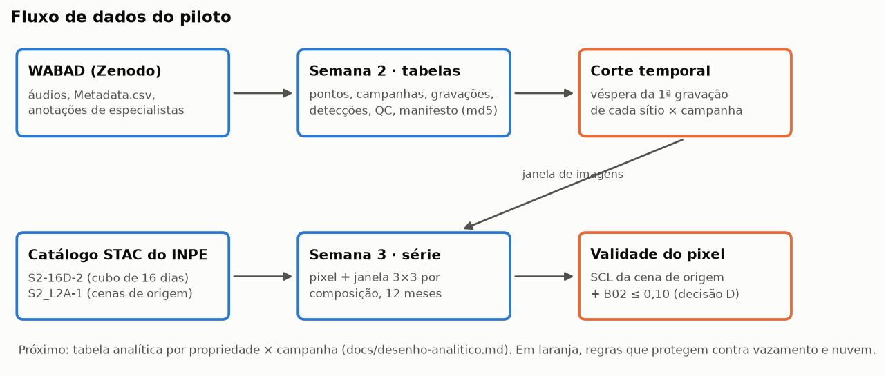

# satbio

**Sensoriamento remoto e bioacústica em cabruca** — projeto de pesquisa independente e voluntário, em ciência aberta, usando dados públicos do INPE.

## Sobre

Sistemas cabruca cultivam cacau sob árvores de sombra no sul da Bahia. Áreas com cobertura arbórea parecida podem abrigar comunidades de aves bem diferentes. Este projeto investiga se o histórico espectral da vegetação e o contexto da paisagem ajudam a explicar essas diferenças.

> Quanto as séries temporais de vegetação acrescentam à predição de indicadores da comunidade de aves em cabruca, depois de considerar sazonalidade, esforço de gravação e contexto paisagístico?

A abordagem combina:

- **Sensoriamento remoto:** séries temporais Sentinel-2 (S2-16D-2) e Landsat (LANDSAT-16D-1) do Brazil Data Cube/INPE, além do PRODES Mata Atlântica para o contexto de supressão no entorno.
- **Monitoramento acústico passivo:** gravações convertidas em detecções por espécie com um reconhecedor existente (BirdNET ou equivalente) e validadas por especialista.
- **Modelagem:** modelos incrementais (referência → um período → paisagem → séries temporais), avaliados fora da amostra com validação por propriedade ou blocos espaciais.

O resultado esperado é quantificar o ganho das séries temporais e os limites de generalização do método. Um ganho pequeno ou nulo também é um resultado válido.

## Status

Piloto técnico executado em 2026-10-02 e 03, com dados abertos e fora de cabruca:

1. **Bases acústicas:** nenhuma base aberta tem gravações em cabruca ou no sul da Bahia, então a pergunta principal depende de parceria ([`docs/bases/`](docs/bases/README.md)).
2. **Áudio:** 72 gravações de 4 sítios do WABAD (Mata Atlântica do Nordeste) vinculadas a pontos, datas e anotações ([`docs/piloto/semana-2.md`](docs/piloto/semana-2.md)).
3. **Série óptica:** Sentinel-2 do Brazil Data Cube nesses pontos, terminando na véspera das gravações, com a máscara de nuvem conferida na cena de origem ([`docs/piloto/semana-3.md`](docs/piloto/semana-3.md)).
4. **Integração e portão G1:** inventário, tabela analítica de exemplo e decisão do G1 ([`docs/piloto/semana-4.md`](docs/piloto/semana-4.md)).

O contato com o grupo de ecologia de aves da UESC foi enviado em 2026-10-04. Até 2026-12-02 (portão G1), a resposta define o caminho: campanha com gravadores (A), estudo retrospectivo com os pontos de escuta que a UESC já coletou (A-retro) ou encerramento com relatório técnico (C).

A [simulação de dimensionamento](docs/simulacao-dimensionamento.md) mostra que, com 10 a 30 cabrucas, o ganho das séries temporais só pode ser estimado de forma exploratória (intervalo de 90% com largura de 0,4 a 1,0); precisão de ±0,10 pediria 85 a 95 cabrucas. O piloto não mediu desempenho de reconhecedor nem capacidade preditiva.



As figuras dos relatórios são geradas por `scripts/figuras_piloto.py` a partir das tabelas do piloto.

## Reproduzir o piloto

```
uv sync
uv run python scripts/reproduzir_piloto.py
```

Roda as quatro etapas (bases, série óptica, integração e figuras). Precisa de internet, baixa cerca de 213 MB do WABAD na primeira vez e leva cerca de 10 minutos. Os dados ficam em `data/`, fora do git; as colunas estão descritas no [dicionário de dados](docs/dicionario-dados.md). A simulação (`scripts/simulacao_dimensionamento.py`) e os testes de nebulosidade (`scripts/nebulosidade_*.py`) rodam separadamente; cada etapa grava um manifesto com o commit e os hashes em `data/processed/<etapa>/`.

## Documentação

| Documento | Conteúdo |
|---|---|
| [`docs/pre-projeto-bioacustica-inpe.pdf`](docs/pre-projeto-bioacustica-inpe.pdf) | Pré-projeto completo (também em `.docx`) |
| [`docs/PRD.md`](docs/PRD.md) | Requisitos, fases condicionadas aos portões de decisão, caminhos A, A-retro e C, riscos |
| [`docs/desenho-analitico.md`](docs/desenho-analitico.md) | Resposta ecológica, modelos, inferência de H2 e decisões A–E |
| [`docs/simulacao-dimensionamento.md`](docs/simulacao-dimensionamento.md) | Quantas cabrucas: precisão do ganho e escolha do método de intervalo |
| [`CLAUDE.md`](CLAUDE.md) | Orientações para o Claude Code neste repositório |

## Tecnologia

Python para consulta STAC, rasters, áudio e modelos; R para estatística ecológica quando necessário.

## Dados e licenças

Áudios, rasters e coordenadas de propriedades não são versionados neste repositório. Código e metadados serão publicados quando permitido, respeitando as licenças das bases e os acordos de parceria.
