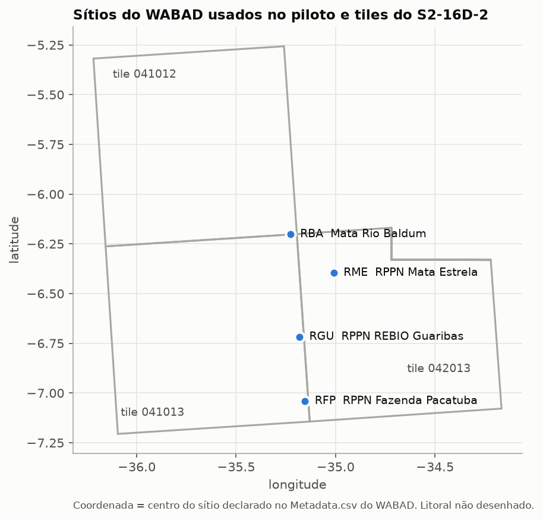
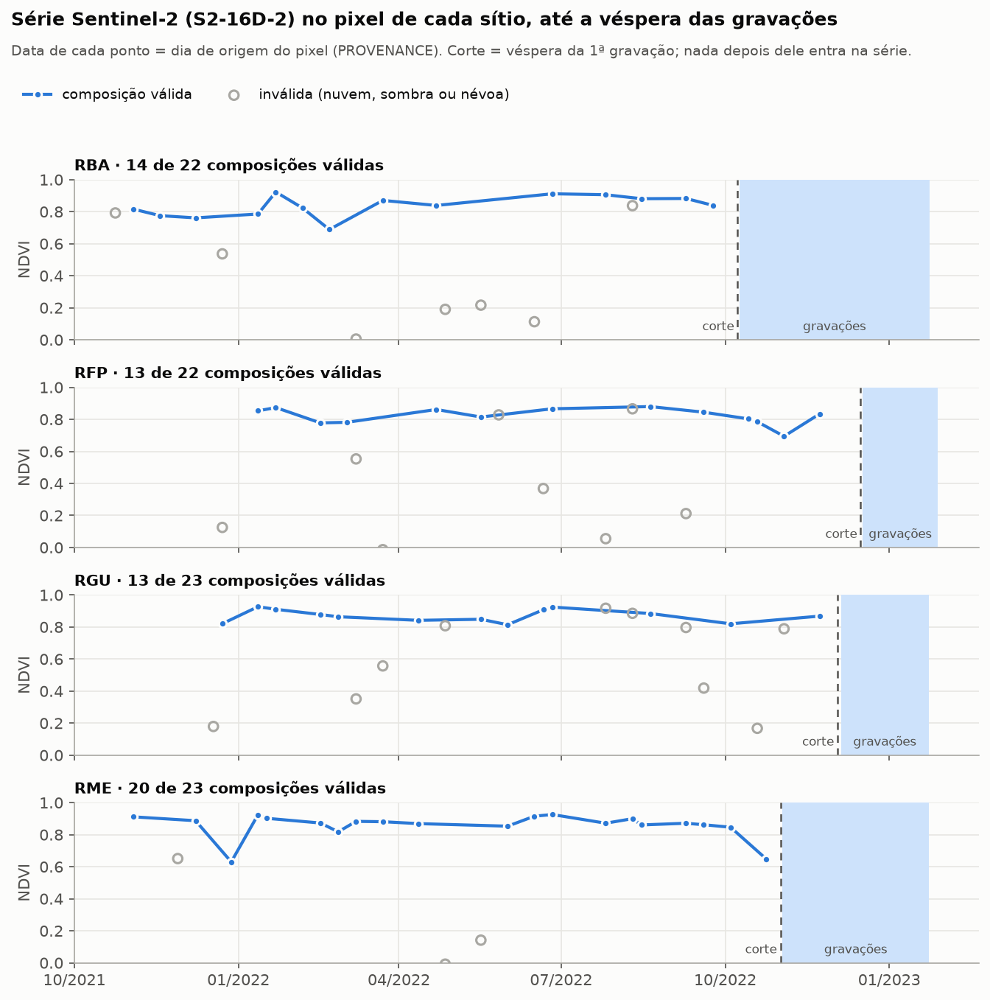
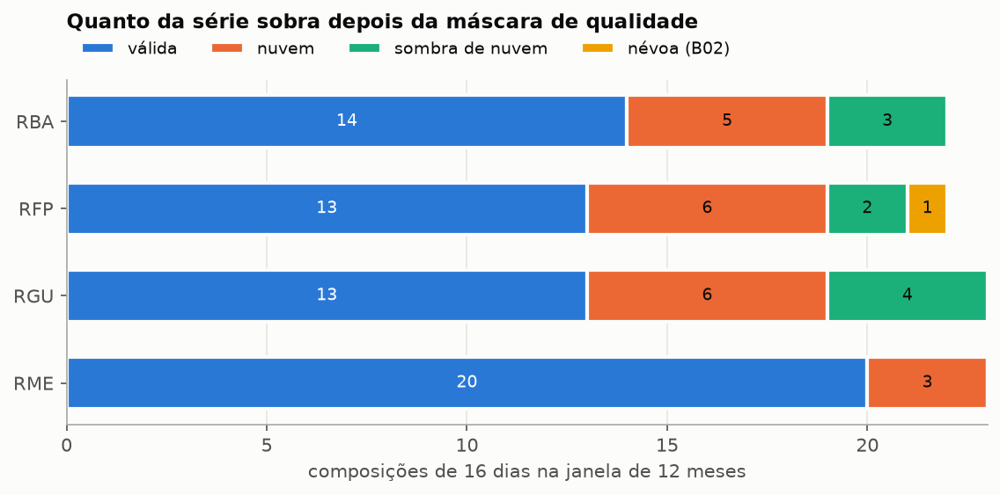
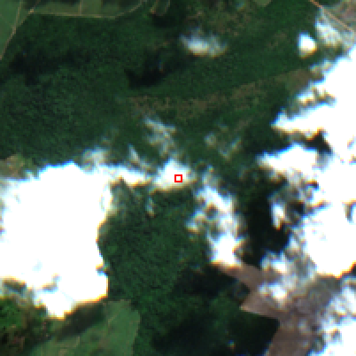
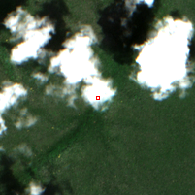
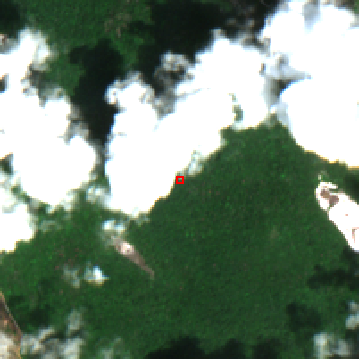

# Piloto — semana 3: série Sentinel-2 do Brazil Data Cube nos pontos

**Data:** 2026-10-03 · **Status:** executado

## O que foi feito

Para os quatro sítios da semana 2 (RBA, RFP, RGU, RME), o catálogo STAC do INPE foi consultado e uma série de um ano da coleção S2-16D-2 foi extraída no ponto de cada sítio, com máscara de qualidade. Cada série termina na véspera da primeira gravação do sítio (PRD, seção 6.3) e só usa composições de 16 dias que terminam até essa data.

Para reproduzir (depende das tabelas da semana 2):

```
uv run python scripts/semana2_wabad.py
uv run python scripts/semana3_stac.py
```

A série vai para `data/processed/stac/serie_s2.csv`, fora do git. O `manifesto.json` registra catálogo, coleção e versão, licença, a consulta de cada sítio, os IDs dos itens com data de atualização e checksum de cada banda, as regras de qualidade, o commit do código e os sha256 das entradas e da saída.

O catálogo é aberto (sem token), e os COGs aceitam leitura parcial por HTTP: cada composição lê só os blocos em volta do ponto. A extração dos quatro sítios leva cerca de 5 minutos.



## Como a série é montada

- **Composições:** cada item do S2-16D-2 é um mosaico de 16 dias que usa, em cada pixel, a observação menos nublada do período. A banda PROVENANCE dá o dia de origem de cada pixel, e a série confere se esse dia cai dentro do período.
- **Bandas:** B02, B04, B08, B8A, B11, os índices NDVI e EVI do próprio cubo, e o NDMI = (B8A − B11)/(B8A + B11), calculado aqui como o índice de umidade do PRD.
- **Pixel e janela:** o pixel de 10 m sobre a coordenada do sítio e a janela 3×3 (30 × 30 m) em volta, resumida em `viz_n_validos`, `viz_*_mediana` e `viz_*_dp` usando só os pixels válidos da janela.
- **Validade (decisão D):** o pixel vale se o SCL da **cena Sentinel-2 de origem** (coleção `S2_L2A-1`, data dada pela PROVENANCE) for 4, 5 ou 6 (vegetação, solo exposto, água), se nenhuma banda estiver sem dado, se a PROVENANCE cair no período e se B02 ≤ 0,10. Pixels inválidos ficam na tabela com o motivo. Duas colunas guardam variantes com o SCL do cubo, para análise de sensibilidade: `valido_scl_cubo_b02` (regra anterior) e `valido_somente_scl_cubo`. Na janela 3×3, a cena de origem é consultada no centro de cada pixel.
- **Tiles:** um ponto perto da borda entre tiles poderia aparecer em dois itens do mesmo período. A série fica com um item por período, o que contém o ponto mais longe da borda, e registra tile, coordenadas no CRS do cubo e linha e coluna do pixel.

## Resultado

| Sítio | Período da série | Composições | Válidas | Janela 3×3 válida (média) | NDVI mediano da janela |
|---|---|---|---|---|---|
| RBA | out/2021–out/2022 | 22 | 14 | 63% | 0,84 |
| RFP | dez/2021–dez/2022 | 22 | 13 | 59% | 0,83 |
| RGU | dez/2021–dez/2022 | 23 | 13 | 57% | 0,87 |
| RME | nov/2021–nov/2022 | 23 | 20 | 86% | 0,87 |

- **Vazamento temporal:** nenhum. Nenhuma composição termina depois do corte, e nenhuma data de origem passa dele.
- **Validade:** 60 de 90 composições são válidas pela regra principal; seriam 61 com o SCL do cubo + B02 e 64 só com o SCL do cubo. As inválidas são nuvem ou sombra. Todas as composições encontraram a cena de origem.
- **Pixel único × janela:** o NDVI do pixel e a mediana da janela diferem 0,002 na mediana das composições (máximo 0,074), e o desvio-padrão dentro da janela fica perto de 0,006. Isso mostra pouca variação do NDVI nessa janela de 30 m, não que a vegetação seja homogênea: o NDVI do cubo usa B8A, reamostrada de 20 m, o que suaviza diferenças entre pixels vizinhos, e o índice não capta estrutura abaixo do dossel.



Nas quatro séries, nenhuma composição passa do corte, e as composições válidas ficam entre 0,7 e 0,9 de NDVI. As inválidas se espalham de 0 a 0,9: nuvem derruba o NDVI, mas sombra e borda de nuvem podem deixá-lo perto do valor real, por isso a máscara não pode depender só do índice.



## Achados que importam para as próximas etapas

- **O SCL do cubo deixou passar nuvem.** Três pixels aceitos pelo SCL tinham azul e vermelho altos e NDVI baixo para floresta: dois classificados como solo exposto (B02 0,25 e 0,39; NDVI 0,37 e 0,18) e um como vegetação (B02 0,111; NDVI 0,65, contra 0,87 típico do sítio). O teste B02 ≤ 0,10 os invalidou. O limiar foi escolhido depois de ver estes casos; a conferência com as cenas de origem (seção abaixo) mostrou que os três são nuvem e que o teste não descartou nenhum pixel limpo, mas também não pega sombra. A regra só com SCL fica guardada para a análise de sensibilidade, e a regra final precisa ser congelada antes de qualquer avaliação confirmatória.
- **O NDVI do cubo usa B8A.** O índice do BDC é (B8A − B04)/(B8A + B04), não usa B08; recalculando com B8A, a diferença é zero. Como B8A e B11 têm 20 m nativos, NDVI e NDMI carregam essa resolução, mesmo distribuídos em 10 m.
- **Sem degrau de reflectância em 2022.** A ESA passou a somar um offset às reflectâncias do Sentinel-2 em 25/01/2022. Nos pixels de vegetação limpos, B04 tem mediana 0,034 antes e 0,029 depois, sem o salto de +0,1 que um offset não corrigido causaria. Ou o BDC corrigiu, ou a coleção não tem o offset.
- **Cobertura desigual.** Pela fase do calendário de 16 dias, a série cobre de 348 a 364 dias, e a fração de composições válidas vai de 57% (RGU) a 87% (RME). Métricas como amplitude sazonal precisam levar isso em conta.
- **A coordenada continua sendo o centro do sítio.** A janela 3×3 mostra que o entorno de 30 m é homogêneo, mas não diz nada sobre onde estavam os gravadores.
- **Licença.** O metadado da coleção diz "proprietary", mas o link de licença aponta para o aviso legal do Copernicus Sentinel, que permite uso livre com atribuição.

## Validação com as cenas de origem

Uma revisão externa apontou que azul alto e NDVI baixo são indícios de névoa, não confirmação. Para cada pixel que o SCL do cubo aceitava (64), foi lida a cena Sentinel-2 L2A original da mesma data (coleção `S2_L2A-1` do mesmo catálogo, data dada pela PROVENANCE) e comparado o SCL da cena com o do cubo.

| SCL na cena de origem | Pixels | Teste B02 ≤ 0,10 |
|---|---|---|
| 4 (vegetação) | 60 | todos passam |
| 8 ou 9 (nuvem) | 3 | os 3 falham |
| 3 (sombra de nuvem) | 1 | passa |

- **Os três casos suspeitos eram nuvem, não névoa.** Na cena de origem o pixel está dentro de uma nuvem (RGU, 18/12/2021) ou na borda dela (RFP, 21/06/2022; RME, 28/11/2021), e o SCL da cena os classifica como nuvem. No cubo, os mesmos pixels aparecem como solo exposto ou vegetação. Recortes em cor real de 2 km, com o pixel marcado em vermelho (Copernicus Sentinel-2, processado pelo INPE/BDC):

    

- **O SCL do cubo diverge da cena de origem em 4 de 64 pixels aceitos (6%).** O teste B02 pegou as 3 nuvens sem nenhum falso positivo entre os 60 pixels limpos, mas não pega sombra: o pixel de RBA em 24/10/2021 é sombra de nuvem na origem e continua marcado como válido.
- **Consequência.** O SCL do cubo não reproduz o da cena de origem, e o motivo não foi investigado (seleção de observação, reamostragem ou geolocalização). Uma regra de validade que confira o SCL da cena de origem usa evidência independente e não depende de limiar escolhido depois de ver os dados; o custo é uma consulta a mais por composição. O teste B02 continua útil como segunda barreira. Essa escolha entra no desenho analítico, antes de congelar a regra.

A regra foi adotada (decisão D) e implementada em `src/satbio/stac.py` (`VerificadorOrigem`), com testes. O SCL de origem lido pela extração bate com esta conferência em 63 de 64 pixels; a diferença é um pixel de borda de nuvem no RFP, porque a conferência lia na coordenada do ponto e a extração lê no centro do pixel do cubo, e o SCL de origem tem 20 m. A extração passou a levar cerca de 7 minutos.

### A cena de origem reproduz o cubo?

A revisão da implementação apontou que, quando mais de uma cena do mesmo dia cobre o pixel, escolher pela ordem do id não garante que seja a cena usada pelo cubo. A comparação das reflectâncias mostrou três coisas:

- **Offset não declarado.** As cenas do `S2_L2A-1` nas baselines N0400 e N0500 trazem o offset de +1000 nos números digitais introduzido pela ESA em 2022, embora o metadado declare só a escala 0,0001. O cubo está sem o offset.
- **O catálogo serve duas versões de algumas datas.** Para 24 das 90 composições há duas cenas no mesmo dia sobre o pixel, em geral a original (N0400) e um reprocessamento (N0500, criado em 2025, depois do cubo, de 2023). Descontado o offset, as cenas N0301 e N0400 reproduzem a B04 do cubo (diferença mediana < 0,001); as N0500 diferem 0,005 na mediana.
- **Desempate pela reflectância.** A extração lê SCL e B04 de todas as candidatas e fica com a que melhor reproduz a B04 do cubo. Se as candidatas discordarem sobre a validade e nenhuma reproduzir o cubo (diferença > 0,01), o pixel sai inválido. Nesta execução não houve conflito, e nenhum pixel válido ficou acima da tolerância; 12 pixels ficaram com cena N0500 por não haver outra.

O CSV registra, por composição, `SCL_origem`, `cena_origem`, `n_cenas_origem`, `conflito_scl_origem`, `dif_b04_origem` e as cenas de todos os pixels da janela (`cenas_origem_janela`); o manifesto lista as cenas com baseline, aquisição e datas de criação, e a versão da coleção de origem.

## Próximo passo (semana 4)

Entregar o inventário de dados e o exemplo reprodutível da integração (semanas 2 e 3 juntas) e registrar a decisão do portão G1.
