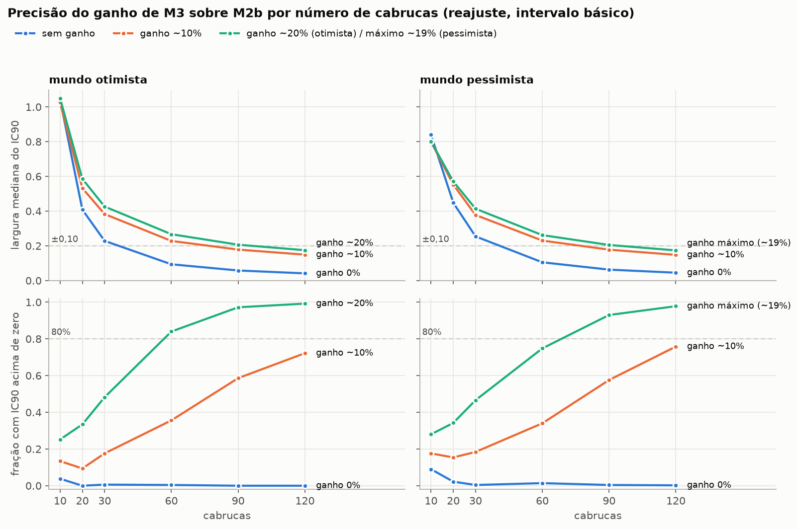

# Simulação de dimensionamento: quantas cabrucas?

**Data:** 2026-10-04 · **Status:** quarta rodada (mundo otimista e pessimista, 10 a 120 cabrucas); fecha o método de inferência e o estimando de H2 ([desenho analítico](desenho-analitico.md), seção 4) e informa a decisão C (seção 9)

## Pergunta

Com quantas cabrucas a análise principal do desenho estima o ganho da dimensão temporal do Sentinel-2 (H2: M3 × M2b) com precisão útil, qual método de intervalo tem a cobertura que promete, e quanto isso muda com suposições menos otimistas?

## O que foi simulado

A simulação gera dados com a estrutura que o estudo supõe e aplica a análise do desenho:

1. **Condição ecológica latente** de cada cabruca: estado médio do dossel (30% da variância), contexto da paisagem (20%), dinâmica temporal (o que H2 testa) e um resíduo que nenhum preditor capta.
2. **Comunidade de aves:** 140 espécies, metade florestais (escala de Oliveira *et al.* 2026); a chance de ocupar a cabruca sobe com a condição para as florestais. Os parâmetros das espécies são sorteados por repetição.
3. **Observação:** 252 minutos por cabruca × campanha (um ponto do protocolo inicial); chance por minuto de cada espécie presente ser gravada sorteada entre 0,0005 e 0,03, o que detecta cerca de 56% das espécies presentes; o reconhecedor acerta 80% das vocalizações gravadas e inclui por engano 1% das espécies ausentes.
4. **Referência (decisão B1):** união das listas de 5 matas independentes, sorteada uma vez por repetição e compartilhada pela amostra e pelos ganhos de referência (na rodada anterior cada amostra tinha a sua, o que somava ruído aos ganhos de referência).
5. **Resposta:** distância de Jaccard entre a lista da cabruca e a referência.
6. **Preditores com ruído:** janela recente, mediana anual, dinâmica e paisagem.
7. **Análise do desenho:** M2b e M3 em regressão ridge (λ = 1), cada cabruca prevista por um modelo ajustado sem ela; ganho = 1 − MAE(M3)/MAE(M2b).
8. **Dois estimandos**, no mesmo mundo da repetição, medidos em 4.000 propriedades novas: o **ganho de população** (modelos ajustados em outras 4.000) e o **ganho alcançável com o n do estudo** (média de 100 ajustes com n cabrucas).

**Dois mundos.** O **otimista** é a estrutura acima, com preditores independentes, sem lacunas ópticas além do ruído, propriedades independentes e referência B1. O **pessimista** acrescenta quatro suposições:

| Suposição | Valor | De onde vem |
|---|---|---|
| Correlação entre estado médio do dossel e dinâmica | 0,5 | Suposição: dossel mais denso tende a variar menos; a parte da dinâmica que a mediana já carrega não acrescenta a M3 |
| Propriedades sem descritor de dinâmica (série abaixo da cobertura mínima; vira a média) | 5% | 1 de 20 pontos do sul da Bahia não passou na cobertura mínima ([nebulosidade](literatura/nebulosidade-sul-bahia.md)) |
| Propriedades com dinâmica degradada (ruído × 2) | 25% | No trimestre mais nublado (39% de composições válidas, ~6 por trimestre), a chance de menos de 2 válidas, mínimo da mudança recente, é de ~25% |
| Vizinhança | pares de propriedades com 50% da variância do resíduo e da paisagem em comum; validação e reamostragem por par | Suposição: cabrucas a ~2 km umas das outras (Oliveira *et al.* 2026) compartilham paisagem e manejo regional |
| Referência | B2: cada mata fica na vizinhança de uma cabruca da amostra e sai da referência quando essa vizinhança é retida | Decisão B do desenho, ainda aberta |

Os cenários foram **calibrados pelo ganho de população** em cada mundo. No otimista: 0%, ~10% (sinal temporal 0,30, ruído do descritor 0,7) e ~20% (0,45 e 0,4). No pessimista: 0%, ~10% (0,30 e 0,2) e o máximo alcançável, ~19% (0,50 e 0,1, sem resíduo e com descritor quase sem ruído). **No mundo pessimista, um ganho de 20% não é alcançável** enquanto dossel e paisagem explicarem metade da variância. Com ruído realista no descritor (0,7), o ganho de população do mundo pessimista fica em ~5%.

São 500 repetições por célula; código em `src/satbio/simulacao.py`, execução com `uv run python scripts/simulacao_dimensionamento.py` (cerca de 13 minutos em 10 núcleos). Saídas e manifesto em `data/processed/simulacao/` (fora do git); a rodada desta versão é do commit `3c276f0`.

## Método de inferência

Quatro intervalos de 90% foram calculados em cada repetição:

- **Erros fixos** (o método anterior do desenho): reamostragem pareada dos erros da validação deixando um fora.
- **Reajuste, percentil:** reamostragem de propriedades com reposição; em cada réplica os modelos são reajustados e a validação por propriedade retida é refeita, com as cópias da retida fora do treino (200 réplicas na simulação). Intervalo pelos quantis das réplicas.
- **Reajuste, básico:** as mesmas réplicas, intervalo 2·ganho − quantis. Cada réplica treina com cerca de 63% de propriedades distintas e por isso sai deslocada para baixo; o intervalo básico desconta esse deslocamento.
- **Validação cruzada corrigida:** 5 dobras repetidas 20 vezes, variância da razão pelo método delta com a correção de Nadeau & Bengio (2003) na forma de Bouckaert & Frank (2004).

Também foi feito o **teste de permutação** do descritor de dinâmica (199 permutações), que testa só se o ganho é maior que zero.

**Cobertura do IC90 contra o ganho alcançável** na rodada que escolheu o método (commit `f25fdcd`, mundo otimista com 10 a 30 cabrucas e um cenário de ~15%; erro de Monte Carlo de ±1,3 ponto por célula):

| Cabrucas | Ganho de população | Ganho alcançável | Erros fixos | Reajuste, percentil | **Reajuste, básico** | CV corrigida |
|---|---|---|---|---|---|---|
| 10 | 0% | −6% | 79% | 100% | 93% | 92% |
| 10 | 11% | 5% | 60% | 99% | 87% | 78% |
| 10 | 14% | 9% | 58% | 100% | 86% | 74% |
| 10 | 22% | 17% | 63% | 99% | 85% | 74% |
| 20 | 0% | −3% | 82% | 100% | 99% | 99% |
| 20 | 11% | 8% | 72% | 94% | 92% | 78% |
| 20 | 14% | 12% | 75% | 93% | 91% | 80% |
| 20 | 22% | 20% | 78% | 96% | 89% | 82% |
| 30 | 0% | −2% | 83% | 100% | 100% | 99% |
| 30 | 11% | 9% | 77% | 90% | 86% | 81% |
| 30 | 14% | 13% | 81% | 93% | 89% | 84% |
| 30 | 22% | 21% | 83% | 93% | 87% | 85% |
| **Geral** | | | **74%** | **97%** | **90%** | **84%** |

Contra o ganho de população, as coberturas gerais são 67%, 95%, 90% e 81%.

**Escolha (2026-10-04): reamostragem de propriedades com reajuste, intervalo básico**, por ter a cobertura geral mais próxima de 90%. Ela fica abaixo de 90% em alguns cenários com ganho (85% a 89%, até 4 pontos além do erro de Monte Carlo) e acima sem ganho (93% a 100%), o que torna falsos positivos raros. O intervalo percentil nunca fica abaixo de 90%, mas é conservador (97% no geral, largura igual); fica registrado como análise de sensibilidade. A validação cruzada corrigida e o método anterior cobrem pouco quando há ganho. O teste de permutação tem o tamanho correto (rejeita 4,6% a 5% das vezes sem ganho, para α = 5%) e é reportado ao lado do intervalo.

**Conferência na rodada com os dois mundos (commit `3c276f0`, 41 células).** A cobertura geral foi de 90,0% para o intervalo básico, 95,1% para o percentil, 87,1% para a validação cruzada corrigida e 79,6% para o método anterior. Por célula, básico e percentil ficam igualmente perto de 90% (desvio médio de 5,3 e 5,4 pontos), mas de lados opostos: **com ganho e 20 ou mais cabrucas, o básico cobre de 82% a 94%, na maioria das células abaixo de 90%, e o percentil cobre de 90% a 95%**. Com 10 cabrucas o básico cai a 72%–88%. Isso deixa uma decisão aberta: manter o básico (cobertura geral mais próxima de 90%, o critério adotado) ou trocar para o percentil, que nunca promete mais precisão do que tem quando há ganho, ao custo de cobrir quase 100% quando não há.

**Estimando: ganho alcançável com o n do estudo.** A justificativa está no desenho analítico (seção 4). O ganho alcançável fica 5 pontos abaixo do de população com 10 cabrucas e 1,5 com 30.

## Resultado

**Precisão da estimativa do ganho, com o método adotado** (ganho alcançável médio; largura mediana do IC90; fração das repetições com IC90 acima de zero; fração em que a permutação rejeita a 5%):

| Mundo | Ganho de população | Cabrucas | Ganho alcançável | Largura do IC90 | IC acima de zero | Permutação |
|---|---|---|---|---|---|---|
| Otimista | 0% | 30 | −2% | 0,23 | 1% | 8% |
| Otimista | 11% | 10 / 20 / 30 | 5% / 8% / 9% | 1,03 / 0,53 / 0,38 | 13% / 9% / 18% | 19% / 39% / 59% |
| Otimista | 11% | 60 / 90 / 120 | 10% / 11% / 11% | 0,23 / 0,18 / 0,15 | 36% / 59% / 72% | 85% / 97% / 100% |
| Otimista | 22% | 10 / 20 / 30 | 17% / 20% / 20% | 1,05 / 0,59 / 0,43 | 25% / 33% / 48% | 32% / 75% / 90% |
| Otimista | 22% | 60 / 90 / 120 | 21% / 22% / 22% | 0,27 / 0,21 / 0,17 | 84% / 97% / 99% | 100% / 100% / 100% |
| Pessimista | 0% | 30 | −2% | 0,25 | 0% | 6% |
| Pessimista | 11% | 10 / 20 / 30 | 6% / 8% / 9% | 0,80 / 0,55 / 0,38 | 18% / 15% / 18% | 16% / 38% / 55% |
| Pessimista | 11% | 60 / 90 / 120 | 10% / 10% / 10% | 0,23 / 0,18 / 0,15 | 34% / 58% / 76% | 86% / 96% / 99% |
| Pessimista | 19% (máximo) | 10 / 20 / 30 | 15% / 17% / 18% | 0,80 / 0,57 / 0,41 | 28% / 34% / 47% | 27% / 69% / 86% |
| Pessimista | 19% (máximo) | 60 / 90 / 120 | 19% / 19% / 19% | 0,26 / 0,21 / 0,17 | 75% / 93% / 98% | 99% / 100% / 100% |

Sem ganho, a permutação rejeita de 3% a 8% das vezes (nominal 5%), e o IC fica acima de zero em 4% (otimista) e 9% (pessimista) das repetições com 10 cabrucas e em no máximo 2% com 20 ou mais. A tabela completa (leituras da decisão E, viés e cobertura de cada método) fica em `data/processed/simulacao/resumo.csv`.

**Número de cabrucas necessário**, lido na grade 10/20/30/60/90/120 (valores entre pontos são interpolação):

| Critério | Ganho ~10% | Ganho ~20% (otimista) / ~19% (pessimista) |
|---|---|---|
| Precisão: IC90 com largura mediana ≤ 0,20 (±0,10, o ganho mínimo da decisão E) | ~85 (os dois mundos) | ~95 (os dois mundos) |
| IC90 acima de zero em 80% das repetições | mais de 120 | ~55 (otimista); ~70 (pessimista) |
| Permutação rejeita em 80% das repetições | ~55 (os dois mundos) | ~25 (otimista); ~30 (pessimista) |

**Sensibilidade com 30 cabrucas**, ligando cada suposição pessimista sozinha no cenário otimista de ~22%:

| Suposição ligada | Ganho de população | Largura do IC90 | IC acima de zero | Permutação | Cobertura (básico) |
|---|---|---|---|---|---|
| Nenhuma (otimista) | 22% | 0,43 | 48% | 90% | 88% |
| Dinâmica correlacionada com o dossel | 15% | 0,41 | 26% | 73% | 86% |
| Lacunas ópticas | 19% | 0,42 | 38% | 85% | 90% |
| Vizinhos dependentes | 22% | 0,43 | 52% | 89% | 88% |
| Referência B2 | 22% | 0,43 | 50% | 91% | 87% |
| Todas | 13% | 0,39 | 23% | 60% | 90% |

## O que isso quer dizer

- **A precisão depende quase só do número de cabrucas.** A largura do IC90 é de 0,8 a 1,05 com 10 cabrucas, ~0,55 com 20, ~0,40 com 30, ~0,25 com 60 e ~0,16 com 120, nos dois mundos. As suposições pessimistas não alargam o intervalo: elas **encolhem o ganho** que há para estimar.
- **Um ganho de 10% é praticamente inalcançável de afirmar com 10 a 30 cabrucas.** Com 30, o intervalo tem ±0,19, o dobro do próprio ganho; ele só exclui zero em 18% das repetições. Precisão de ±0,10 pede 85 a 95 cabrucas; fazer o intervalo excluir zero na maioria das vezes pede mais de 120.
- **Um ganho de ~20% aparece com ~60 cabrucas**, no mundo otimista (IC acima de zero em 84%); no pessimista, ~19% é o teto e pede ~70. Com 30 cabrucas, metade das repetições ainda inclui zero.
- **A correlação entre estado médio e dinâmica é a suposição que mais pesa**: sozinha, tira um terço do ganho (22% → 15%). Lacunas ópticas tiram pouco (22% → 19%); vizinhança e B2 quase não mudam o ganho nem a precisão, porque a validação e a reamostragem já respeitam os grupos.
- **O teste de permutação tem bem mais poder que o intervalo**: com 30 cabrucas detecta um ganho de ~20% em 86% a 90% das vezes, mas um de 10% só em 55% a 59%. Ele responde "há algum ganho?", não "quanto?".
- **10 cabrucas não informam sobre H2** em nenhum mundo; com 10, o intervalo básico ainda cobre mal (72% a 88% com ganho).
- **O MAE comprime o ganho.** Com erros aproximadamente normais, a razão dos MAE é a raiz da razão dos MSE: 10% de ganho em MAE corresponde a cerca de 19% em MSE.

**Decisão C muda.** Na rodada anterior, 30 cabrucas pareciam começar a informar sobre ganhos de ~20%; isso vinha de um intervalo estreito demais. Com intervalos que cobrem o que prometem, o número que a parceria mais provável oferece (10 a 30 agroflorestas já amostradas) **não estima H2 com precisão útil**: com 30, H2 só pode ser reportada como estimativa exploratória com intervalo largo, mais o teste de permutação. Precisão de ±0,10 exigiria 85 a 95 cabrucas, fora do alcance de um projeto voluntário. Quem ler o resultado precisa saber disso antes da coleta, não depois.

## Limites

Os números valem para as suposições acima, que não foram medidas em cabruca: frações de sinal, detectabilidade, erro do reconhecedor, ruído dos descritores, condição das matas, correlação dossel–dinâmica e força da vizinhança. As lacunas vêm de um único ano (2022) e de pontos que não são necessariamente cabrucas. A simulação usa uma campanha por cabruca e ridge com λ fixo, e o descritor de dinâmica é uma variável só (no desenho são dois, amplitude e mudança). O ganho alcançável foi estimado com 100 ajustes por repetição; o erro de Monte Carlo das coberturas é de ±1,3 ponto por célula.

## Decisões que isto fecha ou levanta

1. **Fechado:** método de inferência e estimando de H2 (desenho analítico, seção 4).
2. **Fechado:** H2 é reportada como estimativa com intervalo; a decisão E vira regra de leitura, com as categorias escritas no desenho.
3. **Aberta: intervalo básico ou percentil.** Mesma distância média de 90%; o básico subcobre com ganho, o percentil sobrecobre sem ganho.
4. **Decisão C:** com 10 a 30 cabrucas, H2 fica exploratória. Se a parceria oferecer mais propriedades, ~60 é o mínimo para ver um ganho de ~20% e 85 a 95 para precisão de ±0,10.
